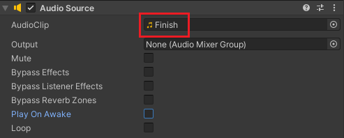

Add the 'Player' tag to your ball. 

Select the goal GameObject and go to the 'Inspector' window. 

Add an AudioSource component.

**Uncheck** 'Play On Awake'.

In the 'Project' window, navigate to 'Assets -> Sounds'. 

Find a tune that you like from the 'Effects' or 'ShortTunes' folders. 

With the goal selected, drag your chosen sound onto the 'AudioClip' source. This example uses the 'Finish' sound from the 'ShortTunes' folder. 

With the goal GameObject selected. Go to the 'Inspector' window and add a new script component called 'FinishEffects'.

Open the 'FinishEffects' script and enter the following code to play a sound when a player reaches the end platform. 

--- code ---
---
language: cs
filename: FinishEffects.cs
line_numbers: true
line_number_start: 1
line_highlights: 
---

using System.Collections;
using System.Collections.Generic;
using UnityEngine;

public class FinishEffects : MonoBehaviour
{
   AudioSource audioSource;

   void Start()
   {
       audioSource = this.gameObject.GetComponent<AudioSource>();
   }

   void OnCollisionEnter(Collision other)
   {
       if (other.gameObject.tag == "Player")
       {
           audioSource.Play();
       }
   }
}

--- /code ---
